Differences between men and women: energy intake, obesity and its
relationship with alcohol consumption
================
Mihir Halai, Peter Zavvos, Robyn Greene, Jasmine Jung, Alan Li, Qingting
Liang, Matilda Robertson

# Executive Summary

The complex problem of obesity is widespread and places a significant
burden on an individual and the society. It is a disease that leads an
individual to have excessive amounts of body fat. Alcohol is also a
cause of concern in today’s society and is strongly associated with
obesity. Alcohol can be a contributing factor to weight gain and
therefore influence obesity, if consumed excessively. The consumption of
alcohol affects every individual differently. The differences are
especially noticeable based on gender. The paper will thus focus on the
sex differences between effect of alcohol consumption on overall energy
intake and obesity.

## Main Findings:

  - For both male and female subjects, increased alcohol consumption
    correlates with higher BMI.
  - This effect is larger in males than females.
  - This may suggest that men who consume more alcohol within their
    diets tend to have a higher BMI in comparison to women. In more
    technical terms: For every unit increase of (percentage of) energy
    consumed from alcahol, men experience a more severe increase in BMI
    than women.
  - Data showed that men who consumed more alcohol consumed more energy
    overall, in comparison to other men.
  - In comparison, women with a higher percentage of their diet from
    alcohol did not have as much of an increase in overall energy
    intake.

## Shortcomings of Analysis:

  - Lack of long term data (dietary is only over two days, biometric
    data often consists of only one measurement per subject).
  - Whilst some data regarding sleep and smoking may have proven to be
    of interest, the data for this variable was found to be insufficient
    for the analysis requested.
  - Ethnicity was of interest to the question and was highlighted as a
    potential factor in the relationship between variables, however the
    data for this variable were found to be too broad for analysis.
  - Certain diseases were flagged as being of interest however relevant
    data was not collected from the subjects.

## Existing Literature

In agreement with other reports, alcohol intake is a risk that can cause
obesity in both sexes if excessive consumed (Suter et al., 2005,
Traversy et al., 2015). Our findings are consistent with Lahti-Koski et
al. (2002) cross-sectional study, but not at all with (Change, 2010),
suggesting a positive association between alcohol consumption and BMI in
men and a negative association in women. This can be explained based on
the findings that women who consume more alcohol, tend to lower energy
intake from non-alcohol sources in their diet, especially carbohydrates,
which is also supported by Chang (2010) study among middle-aged and
older women.

## Clinical Relevance

As the problem of obesity and the contributing factors of alcohol affect
individuals to a great extent, more help for prevention is needed to
reduce this issue. The problem impacts the health care system and the
individuals greatly. Treatment of obesity is not straight forward and
requires time and money. It can be successful for some individuals
however there is no one treatment that can cure the disease. Early
prevention could be a key factor to reduce the problem and give
awareness of the issue of obesity and the influence of alcohol.

Due to the biological differences in alcohol mechanism and biological
responses between men and women after alcohol consumption, increasing
serum triglyceride and HDL cholesterol levels in men (Taylor et al.,
1981) and less alcohol dehydrogenase activity in female occur (Frezza et
al., 1990). Women have a smaller BMI compared to men when having the
same amount of alcohol. This may result from women prefering to restrict
carbohydrate intake from a regular diet after consuming alcohol,
although the origin of this action is unclear. Whether this action
arises from physiological or psychological influences needs to be
further investigated. But because women have a lower alcohol
dehydrogenase activity in the gastric mucus, the higher circulating
ethanol that arises with long-term alcoholic exposure makes females more
susceptible to hepatic injury (Frezza et al., 1990).

# The Problem

The responses of alcohol and its influence on obesity vary between
genders due to the variation in height, weight, body composition,
psychological, metabolic and lifestyle factors. However, the general
idea that alcohol increases the total energy intake is the same in both
genders. Alcohol is seen to have significantly greater effects on men
compared to women in relation to obesity. Serum triglyceride and HDL
levels have been identified to impact the response of alcohol between
the genders. In females the serum triglyceride is found to be lower than
in men. When men consume alcohol, these levels are increased. This may
be due to the reason that females have a much higher fractional
clearance rate of triglyceride compared to men. Men also have much
higher total cholesterol and apolipoprotein, but lower HDL levels
compared to females in response to alcohol. (Taylor, 1981) Another
possible explanation for the differences could be due to the alcoholic
preference variation between men and women. Females are mostly seen to
drink more wine compared to men who prefer beer. Beer and wine have
different effects on the body. Beer consumption is related to protruding
abdomen called ‘beer belly’ leading to a greater waist-to-hip ratio.
(Duncan, 1995) Whereas wine has a lower waist to hip ratio and can have
many beneficial impacts including the reduction of coronary heart
disease if consumed at a moderate rate. Studies have also shown that the
carbohydrate intake based on alcohol consumption varied between the
genders. Women had an overall reduction in carbohydrate intake when
consuming alcohol regularly. This is due to the reason that they reduced
their sugar consumption when increasing alcohol intake. Thus, there is a
decrease in energy consumption from sources when excluding alcohol.
However, when men were consuming alcohol there was limited variation for
the energy intake when excluding alcohol. Sucrose did decrease to a
small extent in males when consuming more alcohol. Overall the calories
that men where consuming from outside sources were added to the alcohol
intake. Whereas in women the energy intake from alcohol was displaced by
sucrose. This explanation is consistent with the finding that newly
sober alcoholics tend to increase their carbohydrate intake and develop
a sweet tooth. (Colditz, 1991)

Frezza et al.(1990) study suggested that females have a lower alcohol
dehydrogenase activity in gastric mucus than male, thus, the ethanol
will be degraded in other pathway such as the liver. Lands & Zakhari
(1991) believed that the hepatic microsomal ethanol oxidizing pathway
makes the ethanol a low-efficiency energy.

In addition, Eigenbrodt el at (2001)’s cross-sectional and longitudinal
study reported that the prevalence of drinking and amount of alcohol
consumption were inversely associated with age in the total population.
However, In the 4 ethnicity and gender groups which were white men,
white women, black men and black women, only black women did not show
significant decrease of drinking prevalence and only white women did not
show a significant decrease in alcohol consumption in their 6 years
follow-up study. The decrease of prevalence and amount of consumption
are suggested to be different based on ethnicity and gender (Eigenbrodt
et al 2001).

Interestingly, there may be a relationship between alcohol intake,
overall energy intake, sugar intake and sex. Colditz et al (1991) found
that overall energy intake increased in drinkers regardless of sex. In
women energy from alcohol tended to displace energy from sucrose,
whereas for men, alcohol energy tended to be added on top of non-alcohol
energy. Further, Gruchow et al (1985) found that drinkers consumed
significantly less carbohydrate than non-drinkers, 16% and 20% less for
women and men respectively. Then looking at carbohydrate density,
Gruchow et al found that as ethanol consumption increased, CHO density
decreased even while overall energy increased, suggesting an interplay
of alcohol and CHO energy intake regulation. Interestingly,
Kampov-Bolevoy et al (1999) found that there may be correlation between
liking sweet things and alcoholism in humans, and over-consuming sweet
fluids and consuming alcohol in rats. Kampov-Poleyvoy et at (2004)
looking at alcoholics, later found that liking sweet things could in
combination with other measures predict alcoholism and that this sweet
liking was associated with alcoholism in the father. Overall, it appears
that there is some interplay between overall energy intake, alcohol
intake and sugar preference.

## The Question

The foundation of this problem is to contruct a predictive model of
obesity based on alcohol intake, energy consumption and sex as features.
This can be done as a regression by considering BMI as a numeric
response or by classifying subjects as obese or not obese.

Of particular interest is the interaction effect between alcohol and sex
on obesity. This is alluded to in the research above. Alcohol has a
greater impact on obesity for males than females. Whether this
interaction is statistically significant is a valid question.

We then explore how alcohol intake is correlated with energy intake for
each sex. Based on the research above, males who consume alcohol tend to
increase their energy intake more than females. Since these features are
correlated, we are interested in whether energy intake is a confounding
variable in the analysis of obesity. In particular, does the interaction
effect between alcohol and sex dissapear when energy is taken into
account.

To explore these questions we first apply linear models and conduct
inference on the coefficients. Next we use classification trees to
classify obese and non obese individuals. Finally we use a Gaussian
graphical model to explore conditional independence of the variables
given fixed energy intake.

# The Data

Documentation for specific procedural choices, such as specific
functions used to reduce data frames, is contained within the associated
R markdown file. For any concerns about data processing not addressed
here, please consult the markdown file associated with this report.
Specific processing of the data set was performed such that the
variables relevant to the question were selected. The following
variables were considered to be of potential relevance:

## Variables used:

  - BMI of participant
  - Alcohol as a percentage of total energy intake
  - Total energy intake
  - Total alcohol intake
  - Total sugar intake
  - Sex of participant
  - Age of participant

Since the question concerned many of the variables listed above, initial
summaries and plots were made for various potential combinations of
variables. Nutrition academics were heavily consulted in further
selection and use of variables to establish relevance and meaning of
each variable.

Data cleaning steps were taken in line with industry standards, such as
removing columns with 0 variance, and analysing NA encodings in line
with the data dictionary associated with the dataset used.

The data frame considering only these variables was then minimised based
on columns with more that 50% NA values, and any rows containing NA
values were eliminated (complete case analysis).

Outliers were identified on the basis of interquartile range and treated
as missing data. Noting that treating outliers in this manner can affect
subsequent interpretations of the data, the authors of this report
consulted Nutrition academics who confirmed that removing any subjects
with unusually high alcohol intake would increase the complexity of the
problem beyond the scope of the question being asked by this report.

Overall, this left a data set of 8794 samples to analyse. The age of
participants spans from 2 to 85, with an average of 40. For data
concerning intake, measurements were taken over two separate days, so in
most cases, the average of the two measurements was deemed appropriate
by the consulting nutrition academics.

## Outliers and Transformations

We first inspect some of our key variables for analysis. One of the
major predictor variables is the percentage of energy coming from
alcohol. This quantity is averaged over the two observed days. We first
examine a boxplot and histogram of this variable.
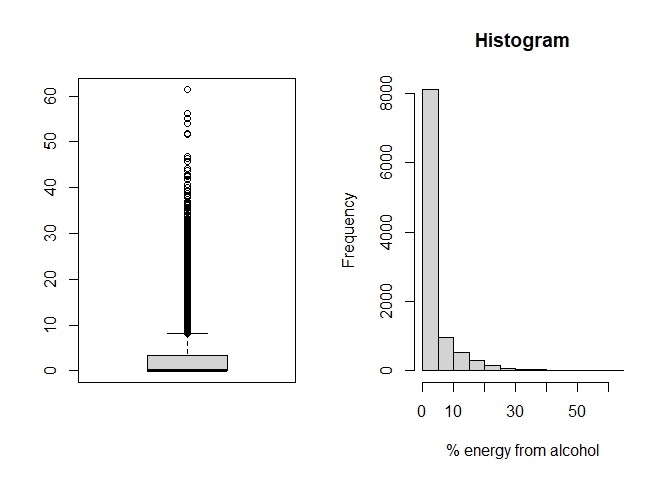<!-- -->

From the boxplot we see there are a number of large values which will
have too much leverage when fitting linear models in the analysis
section. We use a Tukey fence to classify these observations as alcohol
outliers. The proportion of observations classified as such is 0.136.

Furthermore, from the histogram we observe that there are a large
collection of non-drinkers. When we fit a Gaussian graphical model in
the analysis section, we will only consider subjects who consumed some
alcohol on either of the two days. This is done because the spike at
zero breaks the normality assumption of the Gaussian model. The
proportion of non-drinking participants is 0.657.

From now on we will denote the average energy coming from alcohol
(excluding outliers) by `alcohol`.

In order to fit a linear model the response must be normally
distributed. The first plot below is a boxplot of BMI observations.
Clearly the data is positively skewed. After applying a log
tranformation (second plot), the boxplot becomes much more symmetric.

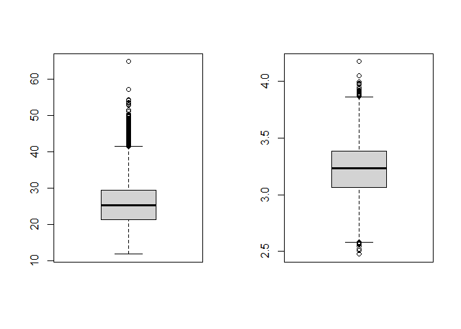<!-- -->

Therefore, in the analysis section we will use the log of the BMI and
denote this variable log(`BMI`). Finally, the variable `sex` is \(0\)
for males and \(1\) for females.

# Data Summaries

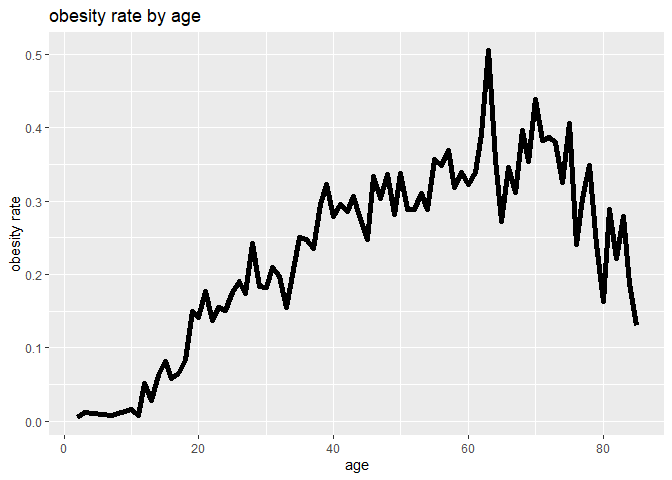

    ## `summarise()` regrouping output by 'AGEC' (override with `.groups` argument)

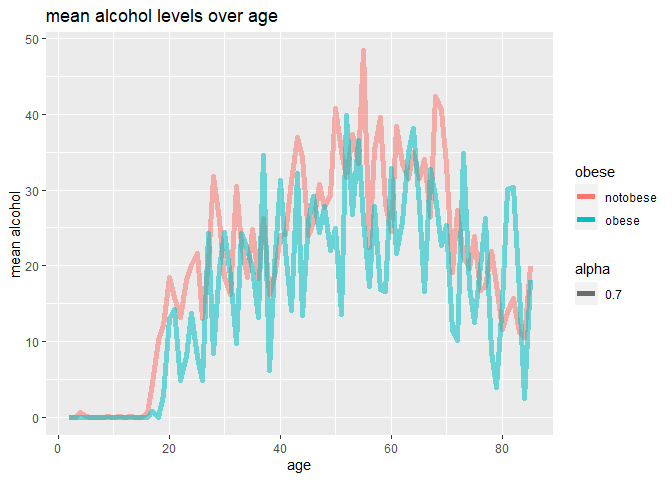

    ## `summarise()` regrouping output by 'AGEC' (override with `.groups` argument)

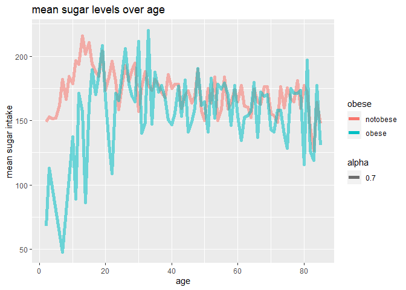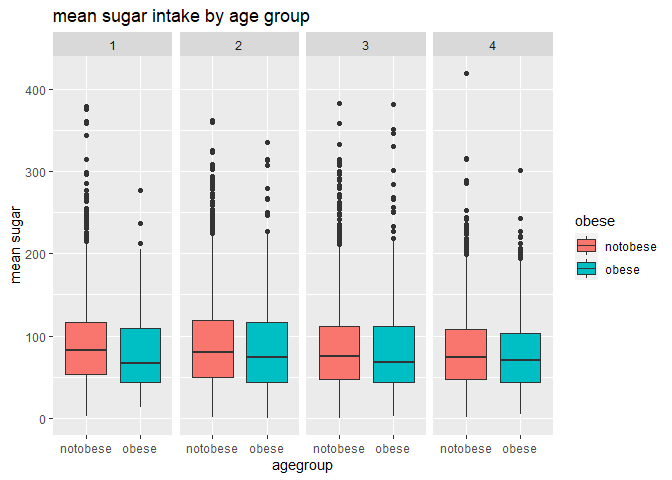

    ## `geom_smooth()` using formula 'y ~ x'

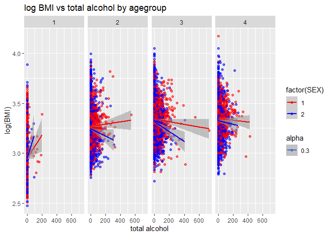

    ## `geom_smooth()` using formula 'y ~ x'

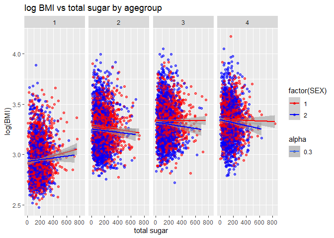

    ## `geom_smooth()` using formula 'y ~ x'

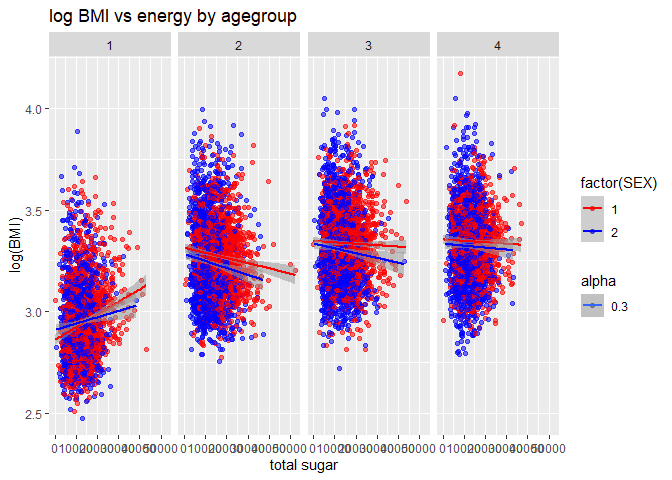

# Analysis

In all models that involve some element of randomness, the R function
set.seed() was used such that results included in this report are fully
reproducible. Code associated with this report is stable, and self
contained given that the data is stored in the format specified in the
“Notes and References” section below. Every effort was made to cross
reference wherever possible. Wherever assumptions were made about the
relevant nutrition knowledge, nutrition academics were consulted during
analysis, and the results presented below are a result of a synergistic
approach to analysis between statistics and nutrition researchers
involved in this report.

## Linear Model

We first investigate the effect of `alcohol` and `sex` on `BMI`. The
following is a plot of log(`BMI`) versus `alcohol` where males are
plotted as blue and females red. The least squares regression line is
fitted seperately for each sex and also plotted.

    ## `geom_smooth()` using formula 'y ~ x'
    ## `geom_smooth()` using formula 'y ~ x'

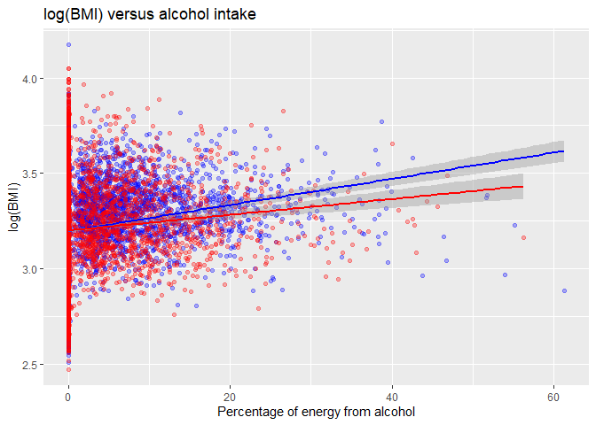<!-- -->

We see that overall larger alcohol consumption is correlated with higher
`BMI`. However, the steepness of the regression line is higher for males
than it is for females. This provides some preliminary evidence for a
possible interaction effect between `sex` and `alcohol` on `BMI`. To
test for such an effect, we fit the following linear model. 
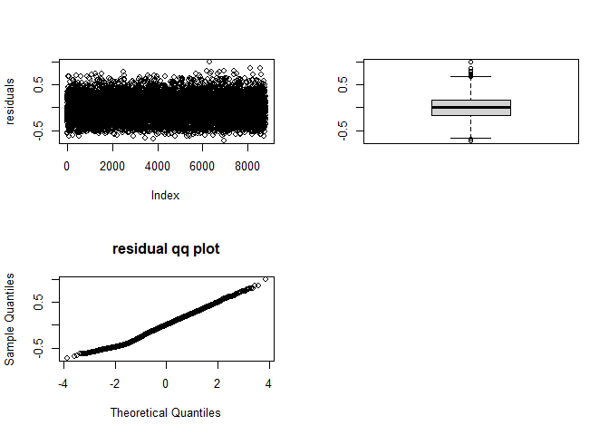<!-- -->

The plots above allow us to check the assumptions of the linear model.
The first plot of the residuals appears random with no pattern
suggesting independence of trials. The boxplot of the residuals is
reasonably symmetric and the qq plot is straight. This suggests that the
residuals can be assumed to be independent and normally distributed with
mean zero. The following output is the data for the interaction term
only.

    ## Estimate Pr(>|t|) 
    ##  -0.0104   0.0001

We see from the output that the estimated interaction coefficient (to 4
d.p) is \(\hat{\beta_3}=-0.0104\). The p-value of the test
\(H_0:\beta_3=0\) vs. \(H_1:\beta_3\neq0\) is very small (\<0.001) so we
conclude that there is a statistically significant interaction effect of
`alcohol` and `sex` on `BMI`. Observe that since the female participants
are encoded as \(SEX=1\) and \(\hat{\beta_3}<0\) then for women the
increase in BMI due to alcohol consumption is \(\textit{less severe}\)
than it is for men. This is consistent with the existing body of
research outlined in the literature review.

We now proceed to explain some of this interaction effect. As was
mentioned in the problem section of the report, current research
suggests that women respond to consuming alcohol by reducing their
consumption of other foods (e.g carbohydrates and sugars). Men on the
other hand add the alcohol to their existing consumption. This is
confirmed by the following plot of total energy intake `energy` versus
`alcohol`.

    ## `geom_smooth()` using formula 'y ~ x'
    ## `geom_smooth()` using formula 'y ~ x'

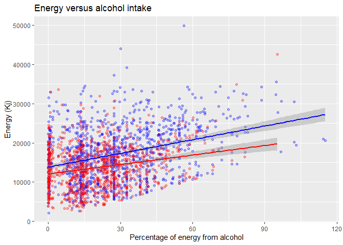<!-- -->

Again the lines are fitted using least squares regression. The
differences in slope suggests that for each increase in alcohol intake
(as % of energy) males increase their energy intake more than females. A
natural question is to ask whether the interaction effect between `sex`
and `alcohol` on BMI can be explained by the fact that males will
consume more energy when they drink.

A first step to answering this question is to extend the linear model
above by adding an `energy` term. The new model becomes  We want to see
whether adding the energy term causes the interaction effect term to
drop off. We fit the new model and again check the diagnostics.
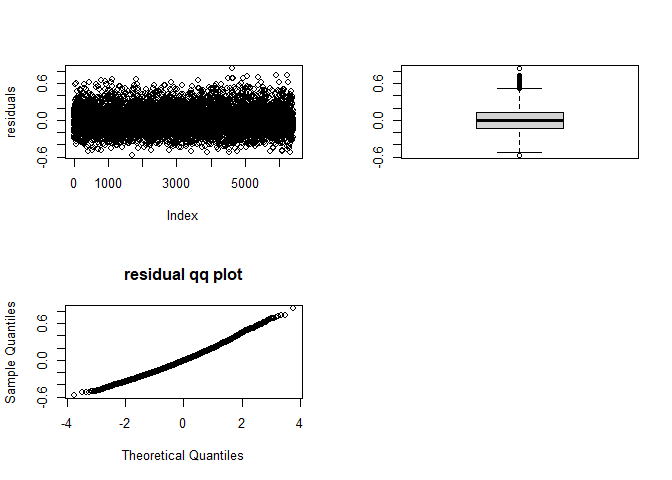<!-- -->

The data for the interaction term of the new model (to 4 d.p) is given
below

    ## Estimate Pr(>|t|) 
    ##  -0.0039   0.0782

Now the p-value for \(H_0:\beta_3=0\) vs. \(H_1:\beta_3\neq0\) is
greater than \(0.05\). We conclude that the interaction effect is small
and not statistically different from \(0\). Also note that the alcohol
main effect is no longer significant. Therefore, the `energy` variable
(which is correlated with the previous predictors of BMI) explained much
of the previously observed variations in `BMI` due to`alcohol` intake
and `sex`.

## Linear, logistic regression, Decision tree

This segment aims to construct three different models using our
variables of interest outlined above. For all these models we will
desgnate a training set containing 70% of the total data with the rest
as testing.

### Linear Model

We construct and cross validate two linear models in order to predict
the log BMI of participants, the first being a base model containing a
sex\*alcohol interaction effect and a second model with an additional
energy intake term. They have the following forms:

We perfrom 10-fold cross validation repeated 10 times on both models and
compare thier in-sample and out-of-sample RMSE’s. We can visualise them
as follows

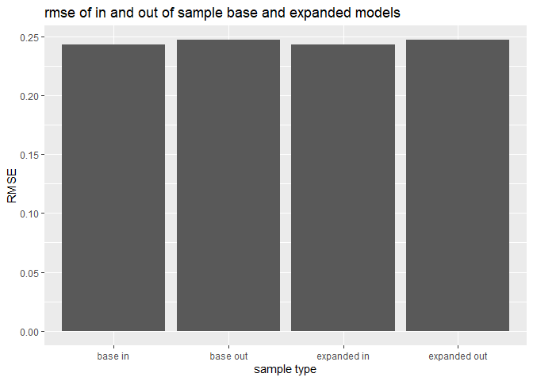<!-- -->

| model          |      RMSE |
| :------------- | --------: |
| Base Model     | 0.2469347 |
| Expanded Model | 0.2469698 |

The RMSE’s for both the base model and the expanded model are near
identical and hence we may conclude that the addition of energy has had
no noteworthy impact on the performace of the linear model.

### Logistic regression

We will consider BMI’s above 30 as obese and hence generate a new
categorical variable taking values ‘obese’ and ‘notobese’ and use this
is a target with alcohol, sugar, energy and sex as predictors. Our model
will be of the form:

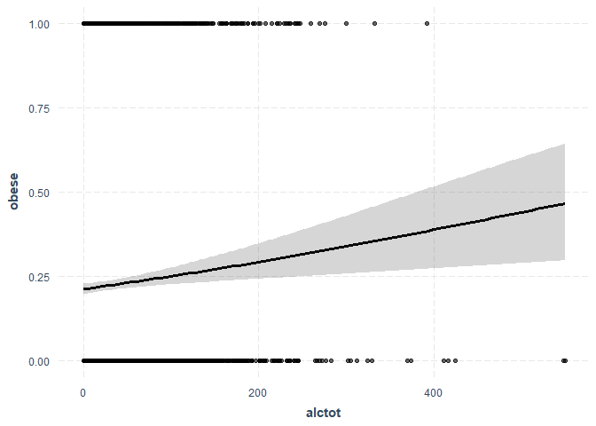<!-- -->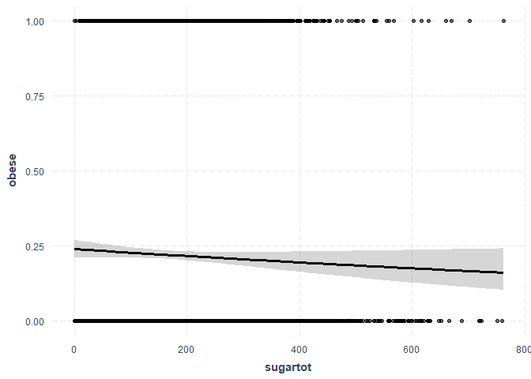<!-- -->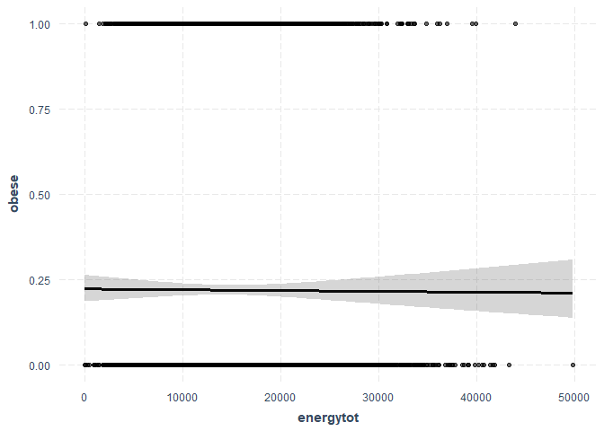<!-- -->

We cross validate the model 10 fold repeated 10 times. The confusion
matrix and accuracy of the model indicate that while the accuarcy is
decent, every obese participant has been misclassified. The regression
plots also confirm a poor fitting regression lacking the characterisic
‘s’ shape.

    ##           
    ## pred       notobese obese
    ##   notobese     2382   671
    ##   obese           1     0

    ## [1] 0.7799607

| model          |      RMSE |
| :------------- | --------: |
| Base Model     | 0.2469347 |
| Expanded Model | 0.2469698 |

### Decision Tree

We further attempt to classify participants into obese and non-obese on
the predictors of total alcohol, total sugar, total energy intake and
sex. These are not however enough variables to grow a tree. To overcome
this we forcibly set the conmplexity parameter to 0, and cross validate
by tuning the minimum bucket size from 2 through to 20.

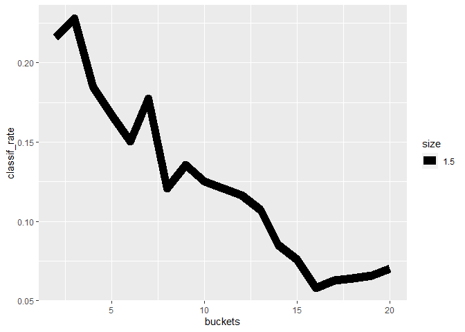<!-- -->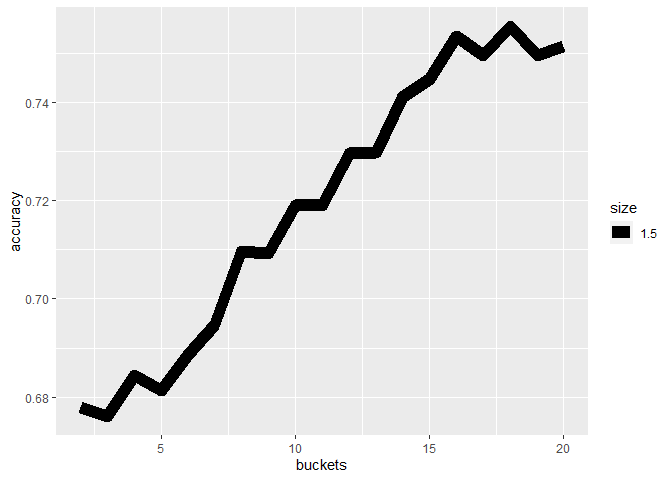<!-- -->

The optimal bucket size is 3. As seen from the plots, the a bucket size
of 3 yield the highest number of correctly identified obese. This number
will reduce for larger buckets. Accuracy will increase for larger
buckets simply because more obese are being misclassified into an
already majority class.

## Gaussian Graphical Model

We have already established that `sex` and `alcohol` are both correlated
with `BMI`. Moreover, there is an interaction effect between the first
two variables on the latter. In particular increased alcohol consumption
lead to a greater increase in BMI for males than it did for females. We
also observed that males who drank more alcohol increased their energy
intake more than females. It is reasonable to ask whether the
interaction effect between `sex` and `alcohol` on `BMI` can be explained
by the differences in total energy intake over the two days of the
survey (`energy`).

To formalise this, we model the data as \(X=(X_1,X_2,X_3,X_4)\) where
\(X_1\) is `BMI`, \(X_2\) is `alcohol`, \(X_3\) is `energy` and \(X_4\)
is `sex`. Let \(\Sigma\) be the covariance matrix of this vector. The
question “does `alcohol` and `sex` only affect `BMI`
\(\textit{through}\) `energy`?” is equivalent to asking “is there a
\(\textit{partial correlation}\) between \(X_2\) and \(X_1\)
\(\textit{given}\) \(X_3\)”. We will denote the partial correlation of
\(X_i\) and \(X_j\) given the rest of the variables by \(\pi_{ij}\).

A graphical model allows us to visualise the dependencies between the
variables. An edge is drawn between node \(i\) and \(j\) if and only if
\(\pi_{ij}\neq0\). So we hypothesis the following graph: the `energy`
node is connected to each other node; and these are the only edges. This
is equivalent to saying that energy intake explains the effects of `sex`
and `alcohol` on `BMI`. If we define \(\Omega := \Sigma^{-1}\), then
\(\Omega\) contains all the information about the partial correlations.
More precisely,  To estimate \(\Omega\) we use LASSO estimation, which
chooses the matrix that maximises the penalised log-likelihood  The
advantage of LASSO is that the penalisation term forces all
“insignificant” terms to become \(0\). This allows us to explicitly
determine which variables are partially uncorrelated. Using the `glasso`
package, the partial correlation matrix using LASSO estimation (with
\(\lambda=1.6\)) is given by

We see that there are only 3 pairs of variables which have non-zero
partial correlation. Each of these involves the variable `energy`. The
graph associated with this model is shown below.

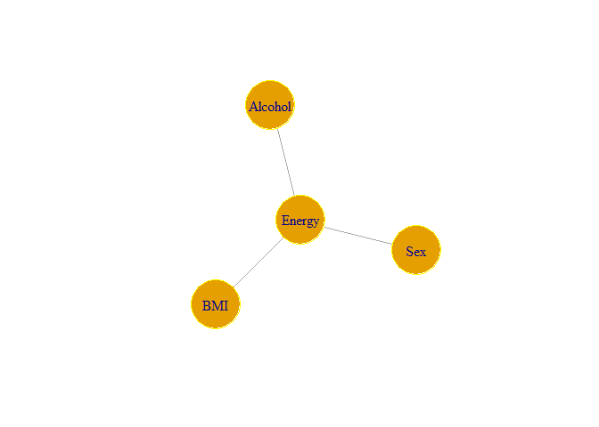<!-- -->

This is precisely the form we hypothesised before. The node `energy`
separates all other nodes. This means that the variables `BMI`, `age`
and `alcohol` are estimated to be conditionally independent.

# Notes and References

Please note that in order to run the Rmd file associated with this
report, all .csv files need to be included in the same directory as the
rmd script in order for the data files to be found.

## References

Chang, Huan (2010) Alcohol Consumption, Weight Gain, and Risk of
Becoming Overweight in Middle-aged and Older Women. JAMA. 303 (18), .
\[online\]. Available from:
<http://search.proquest.com/docview/356659206/>.

Colditz G, Giovannucci E, Rimm E, Stampfer M, Rosner B, Speizer F et
al. Alcohol intake in relation to diet and obesity in women and men.
The American Journal of Clinical Nutrition. 1991;54(1):49-55.

Duncan, B B et al. (1995) Association of the waist-to-hip ratio is
different with wine than with beer or hard liquor consumption.
Atherosclerosis Risk in Communities Study Investigators. American
journal of epidemiology. \[Online\] 142 (10), 1034–1038. Available from:
<http://search.proquest.com/docview/77686803/>.

Frezza, Mario et al. (1990) High Blood Alcohol Levels in Women.: The
Role of Decreased Gastric Alcohol Dehydrogenase Activity and First-Pass
Metabolism. The New England Journal of Medicine. \[Online\] 322 (2),
95–99.

Kampov-Polevoy A. Association between preference for sweets and
excessive alcohol intake: a review of animal and human studies. Alcohol
and Alcoholism. 1999;34(3):386-395.

Kampov-Polevoy A, Eick C, Boland G, Khalitov E, Crews F. Sweet Liking,
Novelty Seeking, and Gender Predict Alcoholic Status. Alcoholism:
Clinical & Experimental Research. 2004;28(9):1291-1298.

Lahti-Koski, Marjaana et al. (2002) Associations of body mass index and
obesity with physical activity, food choices, alcohol intake, and
smoking in the 1982-1997 FINRISK Studies.(Abstract)(Brief Article).
American Journal of Clinical Nutrition. \[Online\] 75 (5), 809–817.

Lands, W E & Zakhari, S (1991) The case of the missing calories. The
American journal of clinical nutrition. \[Online\] 54 (1), 47–48.

Marsha L. Eigenbrodt, Thomas H. Mosley, Richard G. Hutchinson, Robert L.
Watson, Lloyd E. Chambless, Moyses Szklo, Alcohol Consumption with Age:
A Cross-sectional and Longitudinal Study of the Atherosclerosis Risk in
Communities (ARIC) Study, 1987–1995, American Journal of Epidemiology,
Volume 153, Issue 11, 1 June 2001, Pages 1102–1111,
<https://doi.org/10.1093/aje/153.11.1102>

Suter, Paolo M & Tremblay, Angelo (2005) IS ALCOHOL CONSUMPTION A RISK
FACTOR FOR WEIGHT GAIN AND OBESITY? Critical Reviews in Clinical
Laboratory Sciences. \[Online\] 42 (3), 197–227. \[online\]. Available
from: <http://www.tandfonline.com/doi/abs/10.1080/10408360590913542>.

Taylor, K.G et al. (1981) Sex differences in the relationships between
obesity, alcohol consumption and cigarette smoking and serum lipid and
apolipoprotein concentrations in a normal population. Atherosclerosis.
38 (1-2), 11–18.

Traversy, Gregory et al. (2015) Alcohol Consumption and Obesity: An
Update. Current obesity reports. \[Online\] 4 (1), 122–130. \[online\].
Available from: <http://search.proquest.com/docview/1738821158/>.

